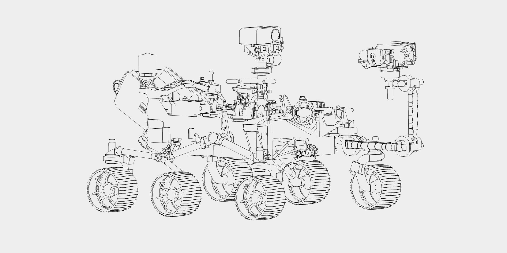

# three-edge-projection


[](https://github.com/gkjohnson/three-edge-projection/actions)
[](https://github.com/gkjohnson/three-edge-projection/)
[](https://twitter.com/garrettkjohnson)
[](https://github.com/sponsors/gkjohnson/)



Edge projection based on [three-mesh-bvh](https://github.com/gkjohnson/three-mesh-bvh/) to extract visible projected lines along the y-axis into flattened line segments for scalable 2d rendering. Additonally includes a silhouette mesh generator based on [clipper2-js](https://www.npmjs.com/package/clipper2-js) to merge flattened triangles.

# Examples

[Geometry edge projection](https://gkjohnson.github.io/three-edge-projection/example/bundle/edgeProjection.html)

[Silhouette projection](https://gkjohnson.github.io/three-edge-projection/example/bundle/silhouetteProjection.html)

[Floor plan projection](https://gkjohnson.github.io/three-edge-projection/example/bundle/floorProjection.html)

# Use

**Generator**

More granular API with control over when edge trimming work happens.

```js
const generator = new ProjectionGenerator();
generator.generate( geometry );

let result = task.next();
while ( ! result.done ) {

	result = task.next();

}

const lines = new LineSegments( result.value, material );
scene.add( lines );
```

**Promise**

Simpler API with less control over when the work happens.

```js
const generator = new ProjectionGenerator();
const geometry = await generator.generateAsync( geometry );
const mesh = new Mesh( result.value, material );
scene.add( mesh );
```


# API

## ProjectionGenerator

### .sortEdges

```js
sortEdges = true : Boolean
```

Whether to sort edges along the Y axis before iterating over the edges.

### .iterationTime

```js
iterationTime = 30 : Number
```

How long to spend trimming edges before yielding.

### .angleThreshold

```js
angleThreshold = 50 : Number
```

The threshold angle in degrees at which edges are generated.

### .includeIntersectionEdges

```js
includeIntersectionEdges = true : Boolean
```

Whether to generate edges representing the intersections between triangles.

### .generate

```js
*generate(
	geometry : MeshBVH | BufferGeometry,
	options : {
		onProgress: ( percent : Number ) => void,
	}
) : BufferGeometry
```

Generate the edge geometry using a generator function.

### .generateAsync

```js
generateAsync(
	geometry : MeshBVH | BufferGeometry,
	options : {
		onProgress: ( percent : Number ) => void,
		signal: AbortSignal,
	}
) : Promise<BufferGeometry>
```

Generate the geometry with a promise-style API.

## SilhouetteGenerator

Used for generating a projected silhouette of a geometry using the [clipper2-js](https://www.npmjs.com/package/clipper2-js) project. Performing these operations can be extremely slow with more complex geometry and not always yield a stable result.

### .iterationTime

```js
iterationTime = 10 : Number
```

How long to spend trimming edges before yielding.

### .doubleSided

```js
doubleSided = false : Boolean
```

If `false` then only the triangles facing upwards are included in the silhouette.

### .sortTriangles

```js
sortTriangles = false : Boolean
```

Whether to sort triangles and project them large-to-small. In some cases this can cause the performance to drop since the union operation is best performed with smooth, simple edge shapes.

### .output

```js
output = OUTPUT_MESH | OUTPUT_LINE_SEGMENTS | OUTPUT_BOTH
```

Whether to output mesh geometry, line segments geometry, or both in an array ( `[ mesh, line segments ]` );

### .generate

```js
*generate(
	geometry : BufferGeometry,
	options : {
		onProgress: ( percent : Number ) => void,
	}
) : BufferGeometry
```

Generate the geometry using a generator function.

### .generateAsync

```js
generateAsync(
	geometry : BufferGeometry,
	options : {
		onProgress: ( percent : Number ) => void,
		signal: AbortSignal,
	}
) : Promise<BufferGeometry>
```

Generate the silhouette geometry with a promise-style API.

