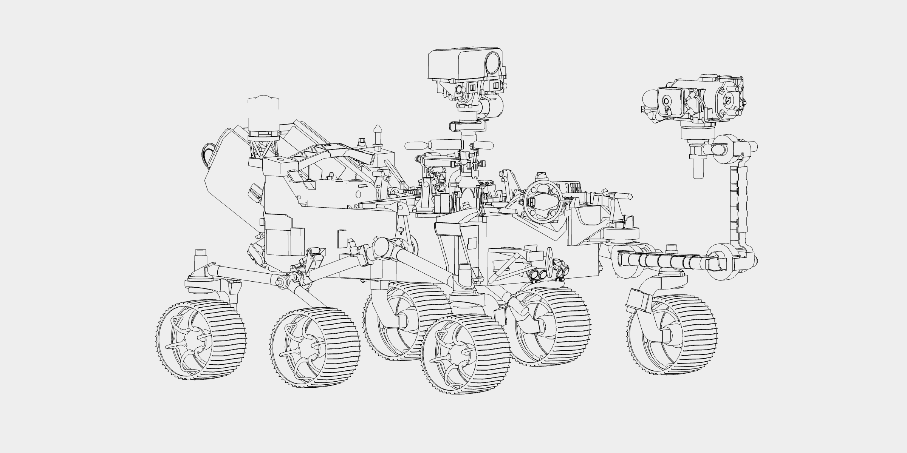

# three-edge-projection


[](https://github.com/gkjohnson/three-edge-projection/actions)
[](https://gkjohnson.github.io/tools/docs/three-edge-projection/)
[](https://github.com/gkjohnson/three-edge-projection/)
[](https://twitter.com/garrettkjohnson)
[](https://github.com/sponsors/gkjohnson/)



Edge projection based on [three-mesh-bvh](https://github.com/gkjohnson/three-mesh-bvh/) to extract visible projected lines along the y-axis into flattened line segments for scalable 2d rendering. Additonally includes a silhouette mesh generator based on [clipper2-js](https://www.npmjs.com/package/clipper2-js) to merge flattened triangles.

# Examples

[Rover edge projection](https://gkjohnson.github.io/three-edge-projection/edgeProjection.html)

[Lego edge projection](https://gkjohnson.github.io/three-edge-projection/edgeProjection.html#lego)

[Silhouette projection](https://gkjohnson.github.io/three-edge-projection/silhouetteProjection.html)

[Floor plan projection](https://gkjohnson.github.io/three-edge-projection/floorProjection.html)

[Planar intersection](https://gkjohnson.github.io/three-edge-projection/planarIntersection.html)

### WebGPU

[Rover edge projection](https://gkjohnson.github.io/three-edge-projection/edgeProjectionWebGPU.html)

# Installation

```
npm install github:@gkjohnson/three-edge-projection
```

# API

See [API.md](./API.md) for full API documentation.

The same documentation is also available on the [docs site](https://gkjohnson.github.io/tools/docs/three-edge-projection/).

# Use

**Generator**

More granular API with control over when edge trimming work happens.

```js
const generator = new ProjectionGenerator();
generator.generate( scene );

let result = task.next();
while ( ! result.done ) {

	result = task.next();

}

const lines = new LineSegments( result.value.getVisibleLineGeometry(), material );
scene.add( lines );
```

**Promise**

Simpler API with less control over when the work happens.

```js
const generator = new ProjectionGenerator();
const result = await generator.generateAsync( scene );
const mesh = new Mesh( result.getVisibleLineGeometry(), material );
scene.add( mesh );
```

**Visibility Culling**

To visibility cull a scene before generation you can use MeshVisibilityCuller before running the projection step.

```js
const input = new MeshVisibilityCuller( renderer ).cull( scene );
const result = await generator.generateAsync( scene );
const mesh = new Mesh( result.getVisibleLineGeometry(), material );
scene.add( mesh );
```
